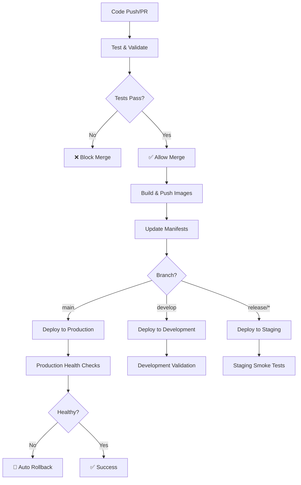

# Platformctl GitHub Actions Workflows

This directory contains comprehensive GitHub Actions workflows for the Platformctl GitOps monitoring platform. The workflows provide complete CI/CD automation including building, testing, security scanning, and deployment.

## 🚀 Workflows Overview

### 1. Build and Push Container Images (`build-and-push.yml`)
**Trigger:** Push to main/develop/release branches, tags, PRs, manual dispatch

**Key Features:**
- Multi-architecture builds (linux/amd64, linux/arm64)
- Pushes to GitHub Container Registry (GHCR)
- Automatic image tagging based on branch/tag
- Security scanning with Trivy
- SBOM and provenance generation
- Automatic manifest updates
- Image cleanup and maintenance

**Image Naming Convention:**
- `main` branch → `ghcr.io/kriipke/platformctl-SERVICE:latest`
- `develop` branch → `ghcr.io/kriipke/platformctl-SERVICE:dev-latest`  
- `release/*` branch → `ghcr.io/kriipke/platformctl-SERVICE:BRANCH-rc`
- Tags (`v*`) → `ghcr.io/kriipke/platformctl-SERVICE:VERSION`
- Pull requests → `ghcr.io/kriipke/platformctl-SERVICE:pr-NUMBER`

### 2. Test and Validate (`test.yml`)
**Trigger:** Push to main/develop, PRs, manual dispatch

**Comprehensive Testing:**
- Go unit tests with race detection
- Code quality (golangci-lint, staticcheck)
- Kubernetes manifest validation
- Security scanning (Gosec, Semgrep, Nancy)
- Docker best practices (Hadolint, Dockle)
- Integration tests with Kind cluster
- Shell script validation
- Documentation checks

### 3. Deploy to Environments (`deploy.yml`) 
**Trigger:** Successful build workflow, manual dispatch

**Deployment Strategy:**
- Automatic deployment based on branch
- Environment-specific configurations
- Rolling deployments with health checks
- Automatic rollback on failure
- Slack notifications
- Deployment validation and smoke tests

**Environment Mapping:**
- `main` → Production
- `develop` → Development  
- `release/*` → Staging

### 4. Cleanup and Maintenance (`cleanup.yml`)
**Trigger:** Weekly schedule (Sundays), manual dispatch

**Maintenance Tasks:**
- Container image cleanup
- Workflow artifact cleanup
- Action cache cleanup
- Security dependency scanning
- Outdated dependency detection

## 🔧 Setup Instructions

### 1. Required Secrets

Add these secrets to your GitHub repository (`Settings → Secrets and variables → Actions`):

```bash
# Kubernetes Access
DEV_KUBECONFIG          # Base64 encoded kubeconfig for development cluster
STAGING_KUBECONFIG      # Base64 encoded kubeconfig for staging cluster  
PROD_KUBECONFIG         # Base64 encoded kubeconfig for production cluster

# Notifications (Optional)
SLACK_WEBHOOK           # Slack webhook URL for deployment notifications

# Container Registry
# GITHUB_TOKEN is automatically provided by GitHub Actions
```

### 2. Environment Setup

Create GitHub Environments for deployment protection:

1. Go to `Settings → Environments`
2. Create environments: `development`, `staging`, `production`
3. Configure protection rules:
   - **Production**: Require reviewers, deployment branches restriction
   - **Staging**: Optional reviewer requirements
   - **Development**: No restrictions

### 3. Branch Protection

Configure branch protection rules:

```yaml
# main branch
- Require status checks to pass before merging
- Require branches to be up to date before merging
- Required status checks:
  - Go Tests
  - Kubernetes Validation (development)
  - Kubernetes Validation (staging)  
  - Kubernetes Validation (production)
  - Security Scan
  - Docker Validation

# develop branch
- Require status checks to pass before merging
- Required status checks:
  - Go Tests
  - Kubernetes Validation (development)
```

## 📦 Container Registry

Images are published to GitHub Container Registry (GHCR):

### Services Available:
- `ghcr.io/kriipke/platformctl-gateway`
- `ghcr.io/kriipke/platformctl-gitops-aggregator`
- `ghcr.io/kriipke/platformctl-app-sync-svc`
- `ghcr.io/kriipke/platformctl-environment-validation-svc`
- `ghcr.io/kriipke/platformctl-context-correlation-svc`
- `ghcr.io/kriipke/platformctl-multi-environment-kube-svc`
- `ghcr.io/kriipke/platformctl-customer-git-branch-svc`

### Pulling Images:
```bash
# Latest stable release
docker pull ghcr.io/kriipke/platformctl-gateway:latest

# Development version
docker pull ghcr.io/kriipke/platformctl-gateway:dev-latest

# Specific version
docker pull ghcr.io/kriipke/platformctl-gateway:v1.0.0
```

### Image Features:
- ✅ Multi-architecture (AMD64, ARM64)
- ✅ Security scanned with Trivy
- ✅ SBOM (Software Bill of Materials)
- ✅ Provenance attestations
- ✅ Non-root execution
- ✅ Minimal attack surface (Alpine base)

## 🔄 CI/CD Pipeline Flow



## 🛠️ Local Development

### Building Images Locally:
```bash
# Build all services for GHCR
make docker-build-ghcr

# Build specific service
make docker-build-gateway

# Push to GHCR (requires authentication)
export GITHUB_TOKEN=your_token
export GITHUB_ACTOR=your_username
make docker-login-ghcr
make docker-push-ghcr
```

### Testing Workflows Locally:
```bash
# Install act (GitHub Actions local runner)
brew install act  # macOS
# or
curl https://raw.githubusercontent.com/nektos/act/master/install.sh | sudo bash

# Run workflows locally
act push                    # Test push workflow
act pull_request           # Test PR workflow
act workflow_dispatch      # Test manual workflow
```

## 📋 Workflow Triggers

### Automatic Triggers:
- **Push to main** → Production deployment
- **Push to develop** → Development deployment
- **Push to release/** → Staging deployment
- **New tag (v*)** → Production release
- **Pull Request** → Test and validate only
- **Weekly schedule** → Cleanup and maintenance

### Manual Triggers:
- **Build & Push** → Choose environment and options
- **Deploy** → Select environment and version
- **Cleanup** → Choose cleanup type

## 🔍 Monitoring and Observability

### Workflow Monitoring:
- GitHub Actions dashboard
- Slack notifications for deployments
- Deployment success/failure tracking
- Security scan results in Security tab

### Image Monitoring:
- Automatic vulnerability scanning
- SBOM generation for supply chain security  
- Image size and layer optimization
- Automated cleanup of old images

## 🛡️ Security Features

### Container Security:
- Non-root container execution
- Read-only root filesystem
- Dropped capabilities
- Security scanning with Trivy
- SBOM and provenance generation

### Workflow Security:
- Minimal permissions (GITHUB_TOKEN)
- Secrets management best practices
- Branch protection rules
- Environment-based deployment controls
- Automatic dependency updates (Dependabot)

## 🚨 Troubleshooting

### Common Issues:

1. **Build Failures:**
   ```bash
   # Check Go module issues
   go mod tidy
   go mod verify
   
   # Check Docker build
   docker build --build-arg SERVICE_NAME=gateway .
   ```

2. **Deployment Failures:**
   ```bash
   # Check Kubernetes context
   kubectl cluster-info
   
   # Validate manifests
   kustomize build deployments/overlays/development | kubectl apply --dry-run=client -f -
   ```

3. **Image Pull Failures:**
   ```bash
   # Login to GHCR
   echo $GITHUB_TOKEN | docker login ghcr.io -u $GITHUB_ACTOR --password-stdin
   
   # Pull image manually
   docker pull ghcr.io/kriipke/platformctl-gateway:latest
   ```

### Debug Workflows:
- Enable debug logging: Add `ACTIONS_STEP_DEBUG=true` to repository secrets
- Use `workflow_dispatch` events for manual testing
- Check workflow logs in Actions tab
- Review security scanning results in Security tab

## 📚 Additional Resources

- [GitHub Actions Documentation](https://docs.github.com/en/actions)
- [GitHub Container Registry](https://docs.github.com/en/packages/working-with-a-github-packages-registry/working-with-the-container-registry)
- [Kustomize Documentation](https://kustomize.io/)
- [Docker Best Practices](https://docs.docker.com/develop/dev-best-practices/)
- [Kubernetes Deployment Strategies](https://kubernetes.io/docs/concepts/workloads/controllers/deployment/)

---

For questions or issues with the CI/CD pipeline, please open an issue in the repository.