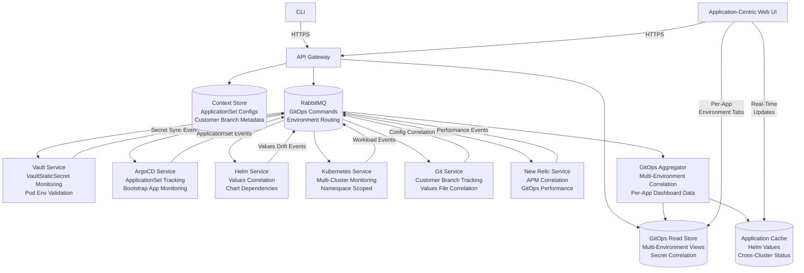

# ContextOps: Production Architecture and Development Guide

**Document status:** Development Ready  
**Version:** 1.0  
**Date:** 2026-01-21  
**Audience:** Platform Engineering, SRE, DevOps, Security, App Owners  
**Repo name (suggested):** `contextops`

> **Development Note:** This README is structured to support phased development. Each major component is marked with implementation phases (🏗️ **PHASE X**) that correspond to development milestones. See `ROADMAP.md` for detailed implementation timeline.

---

## 1. Executive summary

ContextOps is a **GitOps-optimized application monitoring platform** delivered as a **CLI** and **Web UI** that manages **contexts**—comprehensive application definitions spanning multiple environments and customers. Each context represents an **application deployed via GitOps workflows** using ArgoCD ApplicationSets, Helm umbrella charts, and Vault-secured secrets.

**Core GitOps Capabilities:**
- **ApplicationSet Deep Integration**: Monitors Bootstrap Application → ApplicationSets → Generated Applications across customer branches
- **Multi-Environment Correlation**: Tracks applications across dev/qa/uat/prod with unified dashboards and environment tabs
- **Helm Values Orchestration**: Correlates values-dev.yaml, values-qa.yaml, values-uat.yaml, values-prod.yaml with deployed state
- **Vault-Kubernetes Secret Bridge**: Validates Vault secrets match pod environment variables in real-time
- **Customer Isolation**: Supports customer branches with separate configurations and resource tracking

**Application-Centric Interface:**
Per-application dashboards with environment tabs showing:
- ArgoCD ApplicationSet health and sync status  
- Helm chart versions and values drift detection
- Vault secret sync status and pod environment validation
- Kubernetes workload health and resource utilization
- Git configuration correlation across environments

The system integrates deeply with:
- **HashiCorp Vault** (Vault-secrets-operator, static secrets, Kubernetes/AppRole auth)
- **ArgoCD** (ApplicationSets, Bootstrap Applications, multi-source apps, automatic sync)
- **Helm** (umbrella charts, per-environment values files, template rendering)
- **Kubernetes** (multi-cluster support, namespace isolation, workload monitoring)
- **Git** (GitHub Contents API, customer branch tracking, configuration correlation)
- **New Relic** (application performance monitoring, golden metrics)

The system is designed as **microservices** coordinated via **RabbitMQ** with **GitOps-aware message patterns**. A read-optimized **Aggregator** builds consolidated per-application views across all environments for fast dashboard rendering.

---

## 2. Goals, non-goals, and principles

### Goals
- **GitOps-Native Architecture**: ApplicationSet discovery, multi-environment correlation, customer branch management
- **Application-Centric Dashboards**: Per-app views with dev/qa/uat/prod environment tabs and cross-environment comparison
- **Real-Time Secret Validation**: Vault-to-pod environment variable correlation with VaultStaticSecret monitoring
- **Multi-Customer Platform**: Customer branch isolation, resource tracking, configuration governance
- **Helm Values Intelligence**: Values file correlation, umbrella chart dependencies, configuration drift detection
- **Microservice GitOps Integration**: Event-driven workflows optimized for ArgoCD, Helm, and Vault patterns
- **Secure-by-default secrets posture**: Store references not values, with runtime secret-to-pod validation
- **Observability first**: Structured logs, metrics, traces, correlation IDs across GitOps workflows

### Non-goals (initial releases)
- Replacing ArgoCD UI for detailed application management
- Creating/merging pull requests in Git repositories (monitoring and validation only)
- Managing Vault policies or secret rotation (validation and correlation only)
- Helm chart development or publishing (monitoring and correlation only)
- Kubernetes cluster administration (namespace-scoped monitoring only)

### Principles
- **Least privilege** everywhere; enforce at RBAC *and* in code (namespace guards, action allowlists).
- **Idempotent consumers**: events can be redelivered; processing must be safe.
- **Degrade gracefully**: partial results are OK; surface staleness and permissions errors clearly.

---

## 3. Glossary

- **Context**: Application definition with GitOps workflow configuration (ApplicationSets, Helm values, Vault secrets)
- **ApplicationSet**: ArgoCD ApplicationSet that generates applications across environments/customers
- **Environment**: Deployment target (dev/qa/uat/prod) with specific values files and configurations
- **Customer Branch**: Git branch containing customer-specific configuration overrides
- **Values Correlation**: Tracking relationship between values-{env}.yaml files and deployed Helm releases
- **Secret Bridge**: Vault-to-Kubernetes-to-Pod secret validation and correlation
- **Command event**: GitOps operation intent (e.g., `refresh`, `validate`, `sync`) published to RabbitMQ
- **Result event**: Integration service output with GitOps-specific context and correlation
- **Read model**: Denormalized store optimized for multi-environment dashboard queries
- **Correlation ID**: Ties all events and logs for one "run" across GitOps workflow steps

---

## 4. High-level architecture

> 🏗️ **PHASE 1A: Core Architecture** - Implement basic component structure and communication patterns

### 4.1 Components

1. **API Gateway** (Go)
   - AuthN/AuthZ, Context CRUD, GitOps-aware action endpoints, ApplicationSet discovery
2. **RabbitMQ**
   - GitOps command orchestration, result correlation, environment-aware routing
3. **GitOps Integration Services**
   - `vault-svc` — Vault-secrets-operator monitoring, secret-to-pod validation
   - `argocd-svc` — ApplicationSet tracking, Bootstrap Application monitoring, sync orchestration
   - `helm-svc` — Values correlation engine, umbrella chart dependency tracking, template rendering
   - `kube-svc` — Multi-cluster workload monitoring, VaultStaticSecret resource tracking
   - `git-svc` — Customer branch correlation, values file tracking, configuration drift detection
   - `newrelic-svc` — Application performance correlation with GitOps deployments
4. **GitOps Aggregator**
   - Multi-environment state correlation, customer branch tracking, per-app dashboard data
5. **Stores**
   - **Context Store** (Postgres) — ApplicationSet configs, customer branch metadata, multi-env policies
   - **GitOps Read Store** (Postgres) — Environment correlation, values drift, secret sync status
   - **Application Cache** (Redis) — Helm values, ApplicationSet status, cross-cluster data
6. **Application-Centric Web UI**
   - Per-app dashboards with environment tabs (dev/qa/uat/prod)
   - Cross-environment configuration comparison
   - Real-time secret validation displays
   - Customer branch configuration views

### 4.2 Architecture diagram (Mermaid)

> 📋 **Development Priority:** Start with API Gateway → Context Store → Single Integration Service → Basic Aggregator



---

## 5. Key ADRs (Architecture Decision Records)

> 🏗️ **PHASE 1A: Foundation ADRs** - Implement ADR-001 through ADR-005 first

### ADR-001: Event-driven integration workflows
**Decision:** Use RabbitMQ commands/results for integration work.  
**Why:** Integrations are failure-prone, rate-limited, and scale independently.  
**Consequences:** Requires idempotency, DLQs, run tracking, and correlation IDs.

### ADR-002: Read model (CQRS-lite)
**Decision:** Aggregator maintains a read-optimized state per context.  
**Why:** UI needs fast, consolidated reads without fan-out to every integration.  
**Consequences:** Must manage staleness, partial updates, and schema evolution.

### ADR-003: Secrets posture
**Decision:** Store **references** to secrets (Vault paths + keys), not secret values.  
**Why:** Reduces blast radius and compliance headaches.  
**Consequences:** Some operations must fetch secrets at runtime; ensure strict logging controls.

### ADR-004: Kubernetes integration via kubeconfig current-context
**Decision:** Kubernetes access uses a kubeconfig file and **honors current-context** by default (optionally overridden per context). Kubernetes docs define a kubeconfig context as `{cluster, namespace, user}`. [Ref-1]  
**Why:** Matches operator workflows; avoids duplicate credential stores.  
**Consequences:** For hosted UI, kubeconfig handling must be explicit and secure.

### ADR-005: Git browsing via GitHub Contents API + optional clone
**Decision:** Prefer GitHub “Get repository content” API for file browsing; fall back to cloning (go-git) for bulk reads or offline cache. GitHub’s Contents API supports fetching a file/directory by path. [Ref-3]  
**Why:** Faster, less IO, avoids full clones for simple reads.  
**Consequences:** Rate limits; need caching and token strategy.

---

## 6. Context model

> 🏗️ **PHASE 1A: Core Models** - Implement Context schema validation and basic CRUD operations first

### 6.1 Context schema

```yaml
apiVersion: contextops/v1
kind: Context
metadata:
  name: webapp-dev
  labels:
    customer: "acme-corp"
    tier: "production"
spec:
  # Application and Environment Definition
  application:
    name: webapp
    environments:
      - name: dev
        active: true
      - name: qa
        active: true  
      - name: uat
        active: true
      - name: prod
        active: true

  # GitOps Configuration
  gitops:
    # Bootstrap Application that manages ApplicationSets
    bootstrapApplication:
      name: "bootstrap-app"
      namespace: "argocd"
      repoUrl: "https://github.com/acme-corp/gitops-config"
      path: "applications"
      branch: "main"
    
    # ApplicationSet Discovery
    applicationSets:
      - name: "webapp-appset"
        namespace: "argocd"
        generator:
          type: "git"
          directories: ["environments/*"]
        template:
          metadata:
            name: "webapp-{{path.basename}}"
          spec:
            project: "webapp"
    
    # Customer Branch Configuration  
    customerBranch:
      enabled: true
      branch: "customer/acme-corp"
      repository: "https://github.com/acme-corp/webapp-configs"
      
  # Helm Configuration
  helm:
    # Umbrella Chart Configuration
    chart:
      name: "webapp"
      repository: "https://charts.acme-corp.com"
      version: "1.2.3"
    
    # Per-Environment Values Files
    valuesFiles:
      dev: "values-dev.yaml"
      qa: "values-qa.yaml"
      uat: "values-uat.yaml"
      prod: "values-prod.yaml"
    
    # Dependencies Tracking
    dependencies:
      - name: "postgresql"
        version: "12.1.9"
        repository: "https://charts.bitnami.com/bitnami"
      - name: "redis"
        version: "17.3.7"
        repository: "https://charts.bitnami.com/bitnami"

  # Vault Integration (Vault-secrets-operator)
  vault:
    address: "https://vault.acme-corp.com"
    namespace: "platform/dev"
    auth:
      method: "kubernetes"  # or approle
      kubernetes:
        role: "contextops-webapp-dev"
        serviceAccount: "webapp-vault-reader"
    
    # VaultStaticSecret Resources to Monitor
    staticSecrets:
      - name: "webapp-db-creds"
        namespace: "webapp-dev"
        vaultPath: "kv/acme-corp/dev/webapp/database"
        requiredKeys: ["username", "password", "host"]
        destinationSecret: "webapp-db-secret"
      - name: "webapp-api-keys"
        namespace: "webapp-dev" 
        vaultPath: "kv/acme-corp/dev/webapp/api-keys"
        requiredKeys: ["stripe_key", "sendgrid_key"]
        destinationSecret: "webapp-api-secret"
    
    # Pod Environment Variable Validation
    podEnvValidation:
      enabled: true
      pods:
        - name: "webapp-*"
          containers: ["webapp", "sidecar"]
          expectedEnvVars:
            - name: "DB_PASSWORD"
              secretRef: "webapp-db-secret"
              key: "password"
            - name: "STRIPE_API_KEY"
              secretRef: "webapp-api-secret"
              key: "stripe_key"

  # ArgoCD Integration
  argocd:
    address: "https://argocd.acme-corp.com"
    auth:
      method: "vault_token"
      vaultPath: "kv/platform/argocd"
      vaultKey: "token"
    
    # ApplicationSet and Application Selectors
    selectors:
      applicationSets:
        - "webapp-appset"
      applications:
        - pattern: "webapp-*"
          environments: ["dev", "qa", "uat", "prod"]
      project: "webapp"
    
    # Multi-Source Application Support
    sources:
      - name: "helm-charts"
        repoURL: "https://charts.acme-corp.com"
        type: "helm"
      - name: "config-values"
        repoURL: "https://github.com/acme-corp/webapp-configs"
        type: "values"
        branch: "customer/acme-corp"

  # Kubernetes Integration (Multi-Cluster)
  kubernetes:
    clusters:
      dev:
        kubeconfig:
          path: "~/.kube/dev-cluster-config"
          context: "dev-cluster"
        namespace: "webapp-dev"
      qa:
        kubeconfig:
          path: "~/.kube/qa-cluster-config" 
          context: "qa-cluster"
        namespace: "webapp-qa"
      uat:
        kubeconfig:
          path: "~/.kube/uat-cluster-config"
          context: "uat-cluster" 
        namespace: "webapp-uat"
      prod:
        kubeconfig:
          path: "~/.kube/prod-cluster-config"
          context: "prod-cluster"
        namespace: "webapp-prod"
    
    # Resource Monitoring
    resources:
      workloads: ["deployments", "statefulsets", "services"]
      customResources:
        - group: "secrets.hashicorp.com"
          version: "v1beta1"
          kind: "VaultStaticSecret"
    
    # Service Mesh Integration (Istio)
    serviceMesh:
      enabled: true
      type: "istio"
      resources: ["virtualservices", "destinationrules", "gateways"]

  # Git Configuration
  git:
    provider: "github"
    auth:
      method: "github_app"
      vaultPath: "kv/platform/github"
      vaultKey: "token"
    
    repositories:
      # Application Code Repository
      - name: "webapp-code"
        url: "https://github.com/acme-corp/webapp"
        type: "source"
        branches: ["main", "develop"]
      
      # Helm Charts Repository  
      - name: "webapp-charts"
        url: "https://github.com/acme-corp/webapp-helm"
        type: "helm"
        branches: ["main"]
        
      # Configuration Values Repository
      - name: "webapp-configs"
        url: "https://github.com/acme-corp/webapp-configs"
        type: "values"
        branches: ["main", "customer/acme-corp"]
        valuesFiles:
          pattern: "values-*.yaml"
    
    # Configuration Drift Detection
    driftDetection:
      enabled: true
      scheduleMinutes: 15
      notifyOnDrift: true

  # New Relic Integration
  newrelic:
    accountId: 1234567
    region: "US"
    auth:
      method: "vault_api_key"
      vaultPath: "kv/platform/newrelic"
      vaultKey: "api_key"
    
    entitySelector:
      tagFilters:
        - key: "app"
          value: "webapp"
        - key: "customer"
          value: "acme-corp"
      environments: ["dev", "qa", "uat", "prod"]
    
    # Environment-Specific Monitoring
    environmentMetrics:
      dev:
        - "apm.service.transaction.duration"
        - "apm.service.error.rate"
      prod:
        - "apm.service.transaction.duration"
        - "apm.service.error.rate"
        - "apm.service.throughput"
        - "infrastructure.cpu.utilization"

  # Policy and Governance
  policy:
    # Actions allowed per environment
    allowedActions:
      dev: ["refresh", "validate", "sync", "inspect", "rollback"]
      qa: ["refresh", "validate", "sync", "inspect"] 
      uat: ["refresh", "validate", "inspect"]
      prod: ["refresh", "validate", "inspect"]
    
    # MFA Requirements
    requireMfaForActions: 
      - action: "sync"
        environments: ["prod"]
      - action: "rollback"  
        environments: ["uat", "prod"]
    
    # Customer-Specific Policies
    customerPolicies:
      configurationReview: true
      secretsCompliance: "pci-dss"
      retentionDays: 90
      
    # Resource Quotas per Environment
    resourceQuotas:
      dev:
        maxReplicas: 5
        maxCPU: "2000m"
        maxMemory: "4Gi" 
      prod:
        maxReplicas: 20
        maxCPU: "10000m"
        maxMemory: "20Gi"
```

### 6.2 Validation rules (must)

> \ud83d\udcdd **Development Note:** Implement JSON schema validation first, then add custom business rules

**Core Schema Validation:**
- `metadata.name` must match `^[a-z0-9-]+$` (Kubernetes-friendly)
- `spec.application.name` must be valid DNS label
- Customer label must be present: `metadata.labels.customer`
- At least one environment must be active in `spec.application.environments`

**GitOps Configuration Validation:**
- ApplicationSet names must be valid Kubernetes resource names
- Bootstrap application must specify valid Git repository and path
- Customer branch must follow pattern: `customer/{customer-name}` if enabled
- Helm chart repositories must be valid URLs

**Multi-Environment Validation:**
- Each active environment must have corresponding configuration sections
- Values files must follow pattern: `values-{environment}.yaml`
- Kubeconfig paths must exist and be accessible
- Namespace names must be valid per Kubernetes rules

**Vault Integration Validation:**
- VaultStaticSecret names must be unique within namespace
- Pod environment variable mappings must reference valid secrets
- Vault authentication method must match cluster configuration
- Secret paths must follow organizational naming conventions

**Security and Policy Validation:**
- No inline secret values allowed anywhere in the spec
- MFA requirements must specify valid actions and environments
- Resource quotas must not exceed cluster limits
- Customer policies must include required compliance settings

**Cross-Reference Validation:**
- ArgoCD applications must match ApplicationSet templates
- Git repositories must be accessible with provided credentials
- Kubernetes clusters must be reachable and have required namespaces
- New Relic entities must exist for specified tag filters

**Implementation Priority:**
1. Basic GitOps schema validation (ApplicationSets, environments, repositories)
2. Multi-environment consistency validation (values files, clusters, namespaces)
3. Vault integration validation (VaultStaticSecrets, pod environment variables)
4. Cross-service reference validation (ArgoCD apps, Git repos, K8s resources)
5. Security and policy compliance validation

---

## 7. APIs

> 🏗️ **PHASE 1B: API Layer** - Implement in order: Context CRUD → Read endpoints → Action endpoints

### 7.1 GitOps API Endpoints (REST/JSON)

**Implementation Order:**

**Phase 1A - Context CRUD (implement first):**
- `GET /contexts` - List all contexts with customer filtering
- `POST /contexts` - Create new context with GitOps validation
- `GET /contexts/{name}` - Get context by name
- `PUT /contexts/{name}` - Update context with multi-environment validation
- `DELETE /contexts/{name}` - Delete context and cleanup GitOps resources

**Phase 1B - Multi-Environment Read Endpoints:**
- `GET /contexts/{name}/status` - Consolidated status across all environments
- `GET /contexts/{name}/environments` - List all environments (dev/qa/uat/prod)
- `GET /contexts/{name}/environments/{env}/status` - Environment-specific status
- `GET /contexts/{name}/runs?limit=50` - Run history with environment correlation

**Phase 1C - GitOps Action Endpoints:**
- `POST /contexts/{name}/actions/refresh` - Refresh ApplicationSet and environment data
- `POST /contexts/{name}/actions/validate` - Validate GitOps configuration across environments
- `POST /contexts/{name}/actions/inspect` - Deep inspection of GitOps state
- `POST /contexts/{name}/environments/{env}/actions/refresh` - Environment-specific refresh

**Phase 1D - GitOps Read Endpoints:**
- `GET /contexts/{name}/applicationsets` - ApplicationSet discovery and health
- `GET /contexts/{name}/helm/values` - Helm values correlation across environments
- `GET /contexts/{name}/helm/values/diff?from={env1}&to={env2}` - Values file comparison
- `GET /contexts/{name}/secrets/sync-status` - VaultStaticSecret sync status
- `GET /contexts/{name}/secrets/pod-validation` - Pod environment variable validation
- `GET /contexts/{name}/git/branches` - Customer branch status and drift detection

**Phase 1E - Multi-Cluster Kubernetes Endpoints:**
- `GET /contexts/{name}/environments/{env}/workloads` - Environment-specific workloads
- `GET /contexts/{name}/environments/{env}/secrets` - Kubernetes secrets status
- `GET /contexts/{name}/environments/{env}/events` - Environment-specific events
- `GET /contexts/{name}/clusters` - Multi-cluster status overview

**Phase 2A - Advanced GitOps Actions:**
- `POST /contexts/{name}/environments/{env}/actions/sync` - Environment-specific ArgoCD sync
- `POST /contexts/{name}/environments/{env}/actions/rollback` - Environment rollback
- `POST /contexts/{name}/actions/promote?from={env1}&to={env2}` - Environment promotion
- `POST /contexts/{name}/secrets/actions/rotate` - Trigger secret rotation

**Phase 2B - Customer Management Endpoints:**
- `GET /customers/{customer}/contexts` - Customer-specific context listing
- `GET /customers/{customer}/branches` - Customer branch management
- `POST /customers/{customer}/actions/validate-compliance` - Customer compliance validation
- `GET /customers/{customer}/resource-usage` - Customer resource utilization

**Phase 2C - Application-Centric Dashboard APIs:**
- `GET /applications/{app}` - Application overview across all environments
- `GET /applications/{app}/environments` - Environment tabs data
- `GET /applications/{app}/deployment-pipeline` - Deployment progression (dev→qa→uat→prod)
- `GET /applications/{app}/configuration-drift` - Cross-environment configuration analysis
- `GET /applications/{app}/performance-correlation` - GitOps deployment impact on performance

### 7.2 GitOps-Aware AuthN/AuthZ

**Authentication:**
- OIDC for users with customer claim mapping
- Service-to-service via mTLS + JWT service identities
- Customer-specific service accounts for GitOps operations

**Authorization Model:**
- **RBAC roles per customer**: `customer-viewer`, `customer-operator`, `customer-admin`
- **Environment-based permissions**: different access levels per environment (dev/qa/uat/prod)
- **GitOps resource scoping**: access limited to customer branches and ApplicationSets

**ABAC (Attribute-Based Access Control):**
- Customer attribute: `customer={customer-id}` required for all operations
- Environment restrictions: per-context `policy.allowedActions` by environment
- GitOps action gating: ApplicationSet sync, Helm operations, secret access
- MFA requirements: production environment operations, cross-environment promotion

**Customer Isolation:**
- All API endpoints filtered by customer context automatically
- Git branch access limited to customer-specific branches
- Kubernetes namespace access scoped to customer environments
- Vault secret access limited to customer paths

**Permission Examples:**
```yaml
# Customer Admin - Full access to customer resources
customer-admin:
  customers: ["acme-corp"]
  actions: ["*"]
  environments: ["dev", "qa", "uat", "prod"]
  resources: ["contexts", "applicationsets", "secrets", "workloads"]

# Environment Operator - Environment-specific access  
env-operator:
  customers: ["acme-corp"]
  actions: ["read", "refresh", "validate"]
  environments: ["dev", "qa"]
  resources: ["contexts", "workloads"]
  
# Production Viewer - Read-only production access
prod-viewer:
  customers: ["acme-corp"] 
  actions: ["read"]
  environments: ["prod"]
  resources: ["contexts", "workloads", "metrics"]
```

---

## 8. Events and RabbitMQ topology

> 🏗️ **PHASE 1B: Messaging Infrastructure** - Set up basic RabbitMQ topology before integration services

### 8.1 GitOps-Aware Exchanges and Queues

**Exchanges:**
- `contextops.commands` (topic) - GitOps command routing
- `contextops.results` (topic) - Integration service results
- `contextops.gitops` (topic) - GitOps-specific events (ApplicationSet changes, values drift)

**Service Queue Bindings:**
- `vault-svc.q` binds:
  - `cmd.context.*` (all context operations)
  - `cmd.secrets.validate` (VaultStaticSecret validation)
  - `cmd.secrets.pod-validation` (pod env var correlation)
  
- `argocd-svc.q` binds:
  - `cmd.context.sync`, `cmd.context.refresh`, `cmd.context.inspect`
  - `cmd.applicationset.*` (ApplicationSet discovery and monitoring)
  - `cmd.gitops.bootstrap` (Bootstrap Application monitoring)
  
- `helm-svc.q` binds:
  - `cmd.context.refresh`, `cmd.context.inspect`
  - `cmd.helm.values.*` (values correlation and drift detection)
  - `cmd.helm.template.*` (template rendering operations)
  
- `kube-svc.q` binds:
  - `cmd.context.refresh`, `cmd.context.inspect`
  - `cmd.kube.multicluster.*` (multi-cluster operations)
  - `cmd.kube.secrets.*` (Kubernetes secret status)
  
- `git-svc.q` binds:
  - `cmd.context.inspect`, `cmd.context.refresh`
  - `cmd.git.branches.*` (customer branch operations)
  - `cmd.git.drift.*` (configuration drift detection)
  
- `newrelic-svc.q` binds:
  - `cmd.context.refresh`, `cmd.context.inspect`
  - `cmd.newrelic.environments.*` (environment-specific monitoring)
  
- `gitops-aggregator.q` binds:
  - `evt.context.result.*` (all service results)
  - `evt.gitops.*` (GitOps-specific events)
  - `evt.environment.*` (environment-specific events)

**Environment-Specific Routing:**
Commands include environment context for targeted processing:
- `cmd.context.dev.refresh`
- `cmd.context.prod.sync`
- `cmd.environment.qa.validate`

### 8.2 GitOps Message Envelope (JSON)
```json
{
  "schema_version": 1,
  "message_id": "uuid",
  "correlation_id": "uuid",
  "context_name": "webapp-dev",
  "application_name": "webapp",
  "environment": "dev",
  "customer": "acme-corp",
  "action": "refresh",
  "requested_by": "user:alice@acme-corp.com",
  "requested_at": "2026-01-21T18:10:00Z",
  "gitops_context": {
    "applicationset": "webapp-appset",
    "bootstrap_app": "bootstrap-app",
    "customer_branch": "customer/acme-corp",
    "values_files": ["values-dev.yaml"],
    "target_clusters": ["dev-cluster"]
  },
  "payload": {
    "environments": ["dev"],
    "include_secrets_validation": true,
    "include_values_correlation": true
  }
}
```

**GitOps-Specific Result Envelope:**
```json
{
  "schema_version": 1,
  "message_id": "uuid",
  "correlation_id": "uuid", 
  "context_name": "webapp-dev",
  "service": "argocd-svc",
  "environment": "dev",
  "customer": "acme-corp",
  "status": "ok",
  "completed_at": "2026-01-21T18:15:00Z",
  "latency_ms": 450,
  "gitops_metadata": {
    "applicationset_status": "healthy",
    "application_sync_status": "synced",
    "helm_values_drift": false,
    "secret_sync_status": "synchronized"
  },
  "result_payload": {
    "applications": [...],
    "applicationsets": [...],
    "values_correlation": {...}
  }
}
```

### 8.3 Idempotency + retries
- Consumers store processed `message_id` for at least 24h.
- Retry with exponential backoff (max attempts N).
- DLQ per service, plus a “poison pill” alert.

---

## 9. Integration services

> 🏗️ **PHASE 1C: Integration Services** - Implement one service at a time in this order:
> 1. Vault Service (foundation for other integrations)
> 2. Kubernetes Service (local development friendly)
> 3. Git Service (independent, good for testing)
> 4. Argo CD Service (depends on Vault for tokens)
> 5. New Relic Service (depends on Vault for API keys)

Each service:
- Pulls the Context spec from Gateway (or embeds enough in command payload).
- Emits result events with **no secrets**, ever, unless explicitly allowed by policy.

### 9.1 Vault Service

> 🏗️ **PHASE 1C-1: Vault Integration** - **Priority 1** - Foundation for other services

**Capabilities**
- Validate auth method and token acquisition.
- Validate required secret paths/keys exist.
- Optionally fetch short-lived values needed for other services (Argo token, NR API key) and pass via **in-memory only** or **one-time encrypted envelope**.

Vault’s Kubernetes auth validates a service account JWT against the Kubernetes TokenReview API. [Ref-7]

**Result payload**
- `vault.status`: ok/degraded/error
- `vault.validations`: list of path/key checks
- `vault.latency_ms`, `vault.error_code`

### 9.2 Argo CD Service

> 🏗️ **PHASE 1C-4: ArgoCD Integration** - **Priority 4** - Requires Vault service completion

**Capabilities**
- Query Application health/sync status
- Trigger sync/rollback (if allowed)
- Parse Application sources for Git integration: repoURL, path, targetRevision, Helm values config

Argo CD provides API docs via Swagger UI at `/swagger-ui`. [Ref-5]  
Argo CD supports Helm-specific configuration (including inline values via `source.helm.valuesObject`). [Ref-6]

**Result payload**
- `argocd.apps[]`: status, health, revision, sync windows
- `argocd.sync`: initiated/completed, timings, error details
- `argocd.sources[]`: normalized source descriptors for Git browsing

### 9.3 New Relic Service

> 🏗️ **PHASE 1C-5: New Relic Integration** - **Priority 5** - Requires Vault service completion

**Capabilities**
- Resolve entities by selector (tags/type/name)
- Fetch metric snapshots and alert rollups
- Emit “golden metrics” summary

NerdGraph is New Relic’s GraphQL API for querying entity data and configuration. [Ref-8]  
The NerdGraph entities tutorial describes searching and retrieving entity data by attributes and then querying by GUID. [Ref-9]

**Result payload**
- `newrelic.entities[]`: guid, name, tags (filtered), alertSeverity
- `newrelic.metrics`: latency/error/throughput snapshots
- `newrelic.incidents`: active incidents summary (optional)

### 9.4 Kubernetes Service

> 🏗️ **PHASE 1C-2: Kubernetes Integration** - **Priority 2** - Good for local development and testing

**Purpose**
Provide namespace-scoped operational visibility using the **kubeconfig file** as the credential source, respecting the **current-context** and namespace unless explicitly overridden by policy.

Kubernetes docs define kubeconfig contexts as grouping `cluster`, `namespace`, and `user`, and kubectl uses the current context by default. [Ref-1]  
The kubeconfig API spec documents the structure used by clients. [Ref-2]

**Modes**
- **Local mode (default):** CLI (and optionally desktop-hosted UI) reads `~/.kube/config`.
- **Server mode:** Gateway runs in a controlled environment where kubeconfig files are mounted or fetched via Vault references (encrypted at rest). This is the “don’t upload kubeconfigs into random web apps” mode.

**Namespace scoping**
- Determine namespace in this order:
  1) `context.spec.kubernetes.namespaceOverride` (only if allowed by policy)
  2) namespace from kubeconfig current-context
  3) `default`
- Enforce namespace guard in code:
  - All list/get operations must be against the resolved namespace
  - Reject requests that attempt cross-namespace access
- Rely on cluster RBAC to enforce the same constraint (defense in depth)

**Collected signals (namespace-scoped)**
- Deployments/StatefulSets/DaemonSets: desired vs ready, rollout status
- Pods: phase, restarts, readiness, top failing reasons
- Events: warnings (CrashLoopBackOff, ImagePullBackOff, etc.)
- Services/Ingresses: endpoints readiness, ingress address presence
- HPAs: current vs desired replicas
- Optional: `GET /version` if permitted; if denied, mark as “restricted by RBAC”

**Result payload**
- `kube.namespace`: resolved namespace
- `kube.workloads`: rollup counts + top offenders
- `kube.events`: last N warning events
- `kube.permissions`: any denied verbs/resources, surfaced as actionable errors

### 9.5 Git Service

> 🏗️ **PHASE 1C-3: Git Integration** - **Priority 3** - Independent service, good for testing patterns

**Purpose**
Browse files referenced by Argo CD Application sources: manifests, Helm chart files, Helm values files, and overlays. GitHub is the default provider.

GitHub’s REST “Get repository content” endpoint returns the content of a file or directory by path. [Ref-3]

**Inputs**
- Normalized sources from Argo CD service:
  - `repoURL`, `targetRevision`, `path`, `chart`, `helm.valueFiles`, `kustomize`, multi-source lists
- UI/Gateway browse requests: `GET /contexts/{name}/files?path=...`

**Provider strategy**
- **GitHub API (preferred):**
  - Fetch directory listings and file blobs for specific paths and refs.
  - Use GitHub App installation token if available; fall back to PAT.
- **Clone fallback (go-git):**
  - For bulk browsing or when provider API is unavailable.
  - go-git supports `PlainClone` and repository operations in pure Go. [Ref-4]

**Caching**
- Cache directory trees and file blobs (TTL, size limit).
- Cache key includes `repo`, `ref`, `path`, and token identity (to avoid leaking across tenants).

**Argo CD specifics handled**
- Helm values:
  - `valueFiles` (paths relative to chart/source)
  - inline values (`valuesObject`) are shown as virtual file in UI
- Multi-source applications:
  - show a merged “Sources” tree with source labels, and clearly mark which file came from which repo

**Result payload**
- `git.sources[]`: resolved repos/refs
- `git.tree`: directory listing for requested path
- `git.file`: file content (text), syntax hint, size, sha

---

## 10. Aggregator and Read Model

> 🏗️ **PHASE 1D: Aggregator Service** - Implement after at least 2 integration services are complete

### 10.1 Responsibilities
- Consume all `evt.context.result.*` events
- Build a consolidated state document per context
- Track run history and staleness

### 10.2 Read model shape (example)
```json
{
  "context": "app1-dev",
  "updated_at": "2026-01-21T18:15:00Z",
  "staleness_seconds": 42,
  "summary": {
    "health": "degraded",
    "argocd": "ok",
    "vault": "ok",
    "newrelic": "ok",
    "kubernetes": "degraded",
    "git": "ok"
  },
  "details": {
    "argocd": { },
    "vault": { },
    "newrelic": { },
    "kubernetes": { },
    "git": { }
  }
}
```

---

## 11. Security and compliance

> 🏗️ **PHASE 2A: Security Foundation** - Basic security → Enhanced auth → Audit logging
> 🏗️ **PHASE 2B: Advanced Security** - mTLS → Secret rotation → Compliance features

### 11.1 Sensitive data rules
- Never log secrets, tokens, kubeconfigs, or file contents that include secrets.
- Scrub known secret patterns and redact headers (`Authorization`, `X-Vault-Token`, etc.).
- Store only secret references; if secret values must be transiently handled, do it in memory and expire immediately.

### 11.2 Credential sources
- Vault: runtime secret acquisition with short TTL.
- Argo CD token: stored in Vault, scoped.
- New Relic key: stored in Vault, scoped.
- Kubernetes kubeconfig:
  - Local mode: file path on user machine (CLI)
  - Server mode: stored encrypted and access-controlled (or fetched from Vault on demand)
- GitHub tokens:
  - GitHub App installation token preferred (least privilege per repo)

### 11.3 Action gating
- Per-context allowlist for actions
- Environment restrictions (e.g., `sync` only in dev unless admin)
- Optional MFA enforcement for dangerous actions

---

## 12. Observability

> 🏗️ **PHASE 1E: Basic Observability** - Logging → Metrics → Health checks
> 🏗️ **PHASE 3B: Advanced Observability** - Distributed tracing → Business metrics → Alerting

### Logging
- JSON logs; include `correlation_id`, `message_id`, `context_name`, `service`, `action`

### Metrics
- Command processing latency per service
- External API latency and error rate
- RabbitMQ queue depth and DLQ depth
- Cache hit/miss for Git and kube results

### Tracing
- OpenTelemetry across gateway + services
- Propagate trace context in RabbitMQ headers

---

## 13. Deployment and operations

> 🏗️ **PHASE 1F: Basic Deployment** - Docker containers → K8s manifests → Basic networking
> 🏗️ **PHASE 3A: Production Deployment** - HPA → Network policies → Advanced failure handling

### Kubernetes deployment
- Each service as its own Deployment
- HPA on consumer services based on queue depth + CPU
- NetworkPolicies restricting outbound to required endpoints only

### Failure modes
- Argo/NewRelic/Vault down: show partial status with explicit errors and staleness
- RabbitMQ down: disable actions; reads still work from last known state
- Git API rate limits: fall back to clone, or show “rate limited” with retry time

### SLOs (initial)
- UI status read p95 < 250ms (served from read model)
- Command acceptance p95 < 100ms
- Refresh run completion: 90% < 30s for normal cases

---

## 14. Testing strategy

> 🏗️ **PHASE 1G: Foundation Testing** - Unit tests → Basic integration tests
> 🏗️ **PHASE 2C: Advanced Testing** - Contract tests → E2E tests → Security tests

- Unit tests: schema validation, policy enforcement, message routing keys
- Contract tests: event schema compatibility (golden JSON fixtures)
- Integration tests:
  - Argo CD API (mock swagger)
  - Vault dev server
  - New Relic NerdGraph mocked responses
  - Kind cluster for kube-svc namespace-scoped checks
  - GitHub API mocked + go-git local repo tests
- End-to-end: docker-compose with RabbitMQ + Postgres + services

---

## 15. CLI experience

> 🏗️ **PHASE 1H: Basic CLI** - Context CRUD commands → Status commands
> 🏗️ **PHASE 2D: Enhanced CLI** - Interactive features → Advanced operations

Examples:
- `contextops context create -f app1-dev.yaml`
- `contextops context test app1-dev`
- `contextops status app1-dev`
- `contextops sync app1-dev --wait`
- `contextops files app1-dev --path charts/app1/values-dev.yaml`
- `contextops kube app1-dev workloads`

---

## 16. Development Phase Summary

> \ud83d\udcc5 **Quick Reference** - Implementation order for efficient development

### Phase 1: Core System (MVP)
- **1A:** Context model, API Gateway, basic database schema
- **1B:** REST APIs, RabbitMQ setup, basic authentication
- **1C:** Integration services (Vault \u2192 Kube \u2192 Git \u2192 Argo \u2192 NewRelic)
- **1D:** Aggregator service and read model
- **1E:** Basic logging, metrics, health checks
- **1F:** Docker containers, basic K8s deployment
- **1G:** Unit tests, basic integration tests
- **1H:** Essential CLI commands

**Milestone:** Working system with single integration path

### Phase 2: Security & Production Readiness
- **2A:** Enhanced authentication, input validation, audit logging
- **2B:** mTLS, secret rotation, security scanning
- **2C:** Contract tests, security tests, chaos testing
- **2D:** Advanced CLI features, interactive commands

**Milestone:** Production-ready security posture

### Phase 3: Performance & Scale
- **3A:** HPA, network policies, advanced failure handling
- **3B:** Distributed tracing, business metrics, advanced alerting
- **3C:** Caching layers, performance optimization
- **3D:** Multi-tenancy, resource quotas

**Milestone:** Enterprise-ready scalability

---

## Appendix A: Event schemas

### A.1 Command types
- `cmd.context.refresh`
- `cmd.context.validate`
- `cmd.context.sync`
- `cmd.context.inspect`

### A.2 Result types
- `evt.context.result.vault`
- `evt.context.result.argocd`
- `evt.context.result.newrelic`
- `evt.context.result.kubernetes`
- `evt.context.result.git`
- `evt.context.result.aggregate` (optional)

---

## Appendix B: Kubernetes data collection checklist (namespace scoped)

- Deployments, StatefulSets, DaemonSets
- ReplicaSets (optional)
- Pods + PodDisruptionBudgets
- Services + Endpoints/EndpointSlices
- Ingresses
- HPAs
- Events (warnings)
- ConfigMaps (metadata only)
- Secrets (metadata only; never values)

---

## Appendix C: Git file browsing behavior

- Always show:
  - repo, ref, path, sha, size
- Limit file size (e.g., 1 MB) for UI preview
- Detect likely secrets and redact before display
- Support multi-source Argo Apps with source labels

---

## Appendix D: Repo layout (development-optimized)

```
# Phase 1A: Core Foundation
/cmd
  /gateway              # PHASE 1A - Start here
/internal
  /contexts             # PHASE 1A - Core models
  /storage              # PHASE 1A - Database layer
  /auth                 # PHASE 1B - Basic auth
/pkg  
  /api                  # PHASE 1A - Shared DTOs
  /schemas              # PHASE 1A - Validation

# Phase 1B: Messaging & APIs  
/internal
  /events               # PHASE 1B - RabbitMQ setup
/cmd
  /aggregator           # PHASE 1D - After integration services

# Phase 1C: Integration Services (implement in order)
/cmd
  /vault-svc            # PHASE 1C-1 - Priority 1
  /kube-svc             # PHASE 1C-2 - Priority 2  
  /git-svc              # PHASE 1C-3 - Priority 3
  /argocd-svc           # PHASE 1C-4 - Priority 4
  /newrelic-svc         # PHASE 1C-5 - Priority 5
/internal
  /clients              # PHASE 1C - Client libraries
    /vault              # PHASE 1C-1
    /kube               # PHASE 1C-2
    /github             # PHASE 1C-3
    /argocd             # PHASE 1C-4
    /newrelic           # PHASE 1C-5

# Phase 1E+: Supporting Components
/internal
  /observability        # PHASE 1E - Logging, metrics
  /policy               # PHASE 2A - Advanced auth
/cmd
  /cli                  # PHASE 1H - CLI commands
/deploy
  /helm                 # PHASE 1F - K8s deployment
  /docker               # PHASE 1F - Container setup
/web
  /ui                   # PHASE 1I - Web interface
/docs
  /phases               # Development phase docs
```

---

## Appendix E: Development execution guidelines

### Implementation Dependencies
- **Phase 1A Prerequisites:** Go toolchain, PostgreSQL, basic Docker setup
- **Phase 1B Prerequisites:** RabbitMQ instance, authentication framework
- **Phase 1C Prerequisites:** Access to Vault dev server, K8s cluster (kind/minikube OK)
- **Phase 1D Prerequisites:** At least 2 integration services completed
- **Phase 1E Prerequisites:** Prometheus/logging infrastructure decisions

### Testing Strategy per Phase
- **Phase 1A-1D:** Unit tests + basic integration tests
- **Phase 1E-1H:** Add observability and deployment testing
- **Phase 2:** Security testing, contract testing
- **Phase 3:** Performance testing, chaos engineering

### Success Criteria per Phase
- **Phase 1A:** Context CRUD operations work via API
- **Phase 1B:** Commands can be published and consumed via RabbitMQ
- **Phase 1C-X:** Each integration service can fetch and return valid data
- **Phase 1D:** Aggregator builds consolidated view from multiple services
- **Phase 1E:** Full observability stack operational
- **Phase 1F:** System deploys and runs in Kubernetes
- **Phase 1G:** Comprehensive test suite passes
- **Phase 1H:** CLI can perform all basic operations

## Appendix F: Practical "don't shoot yourself" defaults

- Disable `sync` on prod contexts by default.
- Read-only Git tokens unless you explicitly need writes.
- Never store kubeconfigs unencrypted.
- DLQs always enabled, alert on non-zero DLQ depth.


---

## References

- [Ref-1] Kubernetes Docs: Organizing Cluster Access Using kubeconfig Files (context = cluster, namespace, user). https://kubernetes.io/docs/concepts/configuration/organize-cluster-access-kubeconfig/
- [Ref-2] Kubernetes Docs: kubeconfig (v1) API reference. https://kubernetes.io/docs/reference/config-api/kubeconfig.v1/
- [Ref-3] GitHub Docs: REST API endpoints for repository contents. https://docs.github.com/rest/repos/contents
- [Ref-4] go-git: A highly extensible Git implementation in pure Go. https://github.com/go-git/go-git
- [Ref-5] Argo CD Docs: API Docs (Swagger UI). https://argo-cd.readthedocs.io/en/latest/developer-guide/api-docs/
- [Ref-6] Argo CD Docs: Helm support (valuesObject and related settings). https://argo-cd.readthedocs.io/en/latest/user-guide/helm/
- [Ref-7] HashiCorp Vault Docs: Kubernetes auth method API. https://developer.hashicorp.com/vault/api-docs/auth/kubernetes
- [Ref-8] New Relic Docs: Introduction to NerdGraph. https://docs.newrelic.com/docs/apis/nerdgraph/get-started/introduction-new-relic-nerdgraph/
- [Ref-9] New Relic Docs: NerdGraph Entities API tutorial. https://docs.newrelic.com/docs/apis/nerdgraph/examples/nerdgraph-entities-api-tutorial/
