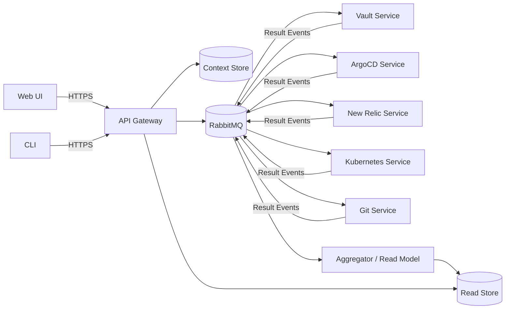

# ContextOps: Production Architecture and Development Guide

**Document status:** Development Ready  
**Version:** 1.0  
**Date:** 2026-01-21  
**Audience:** Platform Engineering, SRE, DevOps, Security, App Owners  
**Repo name (suggested):** `contextops`

> **Development Note:** This README is structured to support phased development. Each major component is marked with implementation phases (🏗️ **PHASE X**) that correspond to development milestones. See `ROADMAP.md` for detailed implementation timeline.

---

## 1. Executive summary

ContextOps is a Go-based system delivered as a **CLI** and a **Web UI** that manages **contexts**—opinionated bundles of configuration and credentials representing an **application + environment** pairing (e.g., `app1-dev`, `app1-prod`). For a selected context, the Web UI produces a consolidated **status/admin panel** by collecting data from:

- HashiCorp Vault (connectivity + secret path validation, optionally short-lived secret reads)
- Argo CD (application status, sync/rollback actions)
- New Relic (APM entity resolution via tags, golden metrics, alert/incident rollups)
- Kubernetes API (namespace-scoped workload health from kubeconfig context)
- Git (GitHub by default) for browsing files referenced by Argo CD Application sources (manifests, Helm values, overlays)

The system is designed as **microservices** coordinated via **RabbitMQ** (commands/results). A read-optimized **Aggregator** builds a per-context “current state” view for fast UI rendering.

---

## 2. Goals, non-goals, and principles

### Goals
- One canonical **Context** model powering both CLI and UI.
- Microservice separation by integration boundary (Vault/Argo/NewRelic/Kubernetes/Git).
- Event-driven workflows for **refresh**, **validate**, **sync**, and **inspect** operations.
- Secure-by-default secrets posture: **store references, not values**, unless explicitly allowed.
- Observability first: structured logs, metrics, traces, correlation IDs across async flows.

### Non-goals (initial releases)
- Replacing Argo CD UI or New Relic UI.
- Persisting Vault secret values as a data lake.
- Full GitOps repo management (PR creation, merging) — browsing/inspection only.

### Principles
- **Least privilege** everywhere; enforce at RBAC *and* in code (namespace guards, action allowlists).
- **Idempotent consumers**: events can be redelivered; processing must be safe.
- **Degrade gracefully**: partial results are OK; surface staleness and permissions errors clearly.

---

## 3. Glossary

- **Context**: `app-env` bundle describing how to access systems for that environment.
- **Command event**: an intent (e.g., `sync`, `refresh`) published to RabbitMQ.
- **Result event**: service output (success/failure payload + timestamps).
- **Read model**: denormalized store optimized for UI queries.
- **Correlation ID**: ties all events and logs for one “run”.

---

## 4. High-level architecture

> 🏗️ **PHASE 1A: Core Architecture** - Implement basic component structure and communication patterns

### 4.1 Components

1. **API Gateway** (Go)
   - AuthN/AuthZ, Context CRUD, action endpoints, publishes command events.
2. **RabbitMQ**
   - Async command fan-out, result fan-in, retries, DLQs.
3. **Integration services**
   - `vault-svc`, `argocd-svc`, `newrelic-svc`, `kube-svc`, `git-svc`
4. **Aggregator**
   - Consumes result events, builds per-context state, exposes read APIs.
5. **Stores**
   - **Context Store** (Postgres) — context specs + policies (no secret values).
   - **Read Store** (Postgres or Postgres+Redis) — context status, run history, cache indexes.
6. **Web UI**
   - Status/admin panel, run history, safe actions.

### 4.2 Architecture diagram (Mermaid)

> 📋 **Development Priority:** Start with API Gateway → Context Store → Single Integration Service → Basic Aggregator



---

## 5. Key ADRs (Architecture Decision Records)

> 🏗️ **PHASE 1A: Foundation ADRs** - Implement ADR-001 through ADR-005 first

### ADR-001: Event-driven integration workflows
**Decision:** Use RabbitMQ commands/results for integration work.  
**Why:** Integrations are failure-prone, rate-limited, and scale independently.  
**Consequences:** Requires idempotency, DLQs, run tracking, and correlation IDs.

### ADR-002: Read model (CQRS-lite)
**Decision:** Aggregator maintains a read-optimized state per context.  
**Why:** UI needs fast, consolidated reads without fan-out to every integration.  
**Consequences:** Must manage staleness, partial updates, and schema evolution.

### ADR-003: Secrets posture
**Decision:** Store **references** to secrets (Vault paths + keys), not secret values.  
**Why:** Reduces blast radius and compliance headaches.  
**Consequences:** Some operations must fetch secrets at runtime; ensure strict logging controls.

### ADR-004: Kubernetes integration via kubeconfig current-context
**Decision:** Kubernetes access uses a kubeconfig file and **honors current-context** by default (optionally overridden per context). Kubernetes docs define a kubeconfig context as `{cluster, namespace, user}`. [Ref-1]  
**Why:** Matches operator workflows; avoids duplicate credential stores.  
**Consequences:** For hosted UI, kubeconfig handling must be explicit and secure.

### ADR-005: Git browsing via GitHub Contents API + optional clone
**Decision:** Prefer GitHub “Get repository content” API for file browsing; fall back to cloning (go-git) for bulk reads or offline cache. GitHub’s Contents API supports fetching a file/directory by path. [Ref-3]  
**Why:** Faster, less IO, avoids full clones for simple reads.  
**Consequences:** Rate limits; need caching and token strategy.

---

## 6. Context model

> 🏗️ **PHASE 1A: Core Models** - Implement Context schema validation and basic CRUD operations first

### 6.1 Context schema

```yaml
apiVersion: contextops/v1
kind: Context
metadata:
  name: app1-dev
spec:
  app:
    name: app1
    environment: dev

  policy:
    allowedActions: ["refresh", "validate", "sync", "inspect"]
    requireMfaForActions: ["sync"]
    kubernetes:
      enforceNamespaceFromKubeconfig: true
      allowNamespaceOverride: false

  vault:
    address: "https://vault.example.com"
    namespace: "platform/dev"
    auth:
      method: "kubernetes"
      kubernetes:
        role: "contextops-app1-dev"
        serviceAccount: "contextops-vault-reader"
    secrets:
      - logicalName: "argocd"
        path: "kv/platform/dev/argocd"
        requiredKeys: ["token"]
      - logicalName: "newrelic"
        path: "kv/platform/dev/newrelic"
        requiredKeys: ["api_key"]

  argocd:
    address: "https://argocd.example.com"
    auth:
      tokenRef:
        vaultSecretLogicalName: "argocd"
        key: "token"
    selectors:
      apps: ["app1"]
      project: "app1"
    operations:
      sync:
        allowed: true
        prune: false
        dryRunDefault: true

  newrelic:
    accountId: 1234567
    region: "US"
    auth:
      apiKeyRef:
        vaultSecretLogicalName: "newrelic"
        key: "api_key"
    entitySelector:
      tagFilters:
        - key: "app"
          value: "app1"
        - key: "env"
          value: "dev"
    metrics:
      - name: "apm.service.transaction.duration"
        window: "5m"
      - name: "apm.service.error.rate"
        window: "5m"

  kubernetes:
    kubeconfig:
      path: "~/.kube/config"
      contextOverride: ""        # empty => use current-context
    namespaceOverride: ""        # empty => use namespace from kubeconfig context

  git:
    provider: "github"
    auth:
      method: "github_app"       # or pat/ssh
      secretRef:
        vaultPath: "kv/platform/dev/github"
        key: "token"
    browse:
      defaultOrg: "my-org"
      cacheTtlSeconds: 300
```

### 6.2 Validation rules (must)

> \ud83d\udcdd **Development Note:** Implement JSON schema validation first, then add custom business rules

- `metadata.name` must match `^[a-z0-9-]+$` (k8s-friendly).
- If `policy.kubernetes.enforceNamespaceFromKubeconfig=true`, ignore `namespaceOverride`.
- Secrets are references only; forbid inline secret material in the context spec.

**Implementation Priority:**
1. Basic schema validation (required fields, types)
2. Name format validation  
3. Secret reference validation
4. Cross-field business rule validation

---

## 7. APIs

> 🏗️ **PHASE 1B: API Layer** - Implement in order: Context CRUD → Read endpoints → Action endpoints

### 7.1 Gateway endpoints (REST/JSON)

**Implementation Order:**

**Phase 1A - Context CRUD (implement first):**
- `GET /contexts` - List all contexts
- `POST /contexts` - Create new context
- `GET /contexts/{name}` - Get context by name
- `PUT /contexts/{name}` - Update context
- `DELETE /contexts/{name}` - Delete context

**Phase 1B - Read Endpoints (implement after aggregator):**
- `GET /contexts/{name}/status` - Get current status from read model
- `GET /contexts/{name}/runs?limit=50` - Get run history

**Phase 1C - Action Endpoints (implement with integration services):**
- `POST /contexts/{name}/actions/refresh` - Refresh all data
- `POST /contexts/{name}/actions/validate` - Validate configuration
- `POST /contexts/{name}/actions/inspect` - Fetch detailed state

**Phase 1D - Advanced Read Endpoints:**
- `GET /contexts/{name}/files?path=...` - Browse Git files
- `GET /contexts/{name}/kube/workloads` - Kubernetes workload status

**Phase 2A - Action Endpoints (implement after security hardening):**
- `POST /contexts/{name}/actions/sync` - Trigger ArgoCD sync (requires enhanced auth)

### 7.2 AuthN/AuthZ
- Prefer OIDC for users; service-to-service via mTLS + JWT service identities.
- RBAC roles: `viewer`, `operator`, `admin`.
- ABAC: per-context `policy.allowedActions`, environment restrictions, optional MFA gates.

---

## 8. Events and RabbitMQ topology

> 🏗️ **PHASE 1B: Messaging Infrastructure** - Set up basic RabbitMQ topology before integration services

### 8.1 Exchanges and queues
- Exchange: `contextops.commands` (topic)
- Exchange: `contextops.results` (topic)
- Queues (bind by routing key):
  - `vault-svc.q` binds `cmd.context.*`
  - `argocd-svc.q` binds `cmd.context.sync`, `cmd.context.refresh`, `cmd.context.inspect`
  - `newrelic-svc.q` binds `cmd.context.refresh`, `cmd.context.inspect`
  - `kube-svc.q` binds `cmd.context.refresh`, `cmd.context.inspect`
  - `git-svc.q` binds `cmd.context.inspect`, `cmd.context.refresh`
  - `aggregator.q` binds `evt.context.result.*`

### 8.2 Message envelope (JSON)
```json
{
  "schema_version": 1,
  "message_id": "uuid",
  "correlation_id": "uuid",
  "context_name": "app1-dev",
  "action": "sync",
  "requested_by": "user:alice",
  "requested_at": "2026-01-21T18:10:00Z",
  "payload": { }
}
```

### 8.3 Idempotency + retries
- Consumers store processed `message_id` for at least 24h.
- Retry with exponential backoff (max attempts N).
- DLQ per service, plus a “poison pill” alert.

---

## 9. Integration services

> 🏗️ **PHASE 1C: Integration Services** - Implement one service at a time in this order:
> 1. Vault Service (foundation for other integrations)
> 2. Kubernetes Service (local development friendly)
> 3. Git Service (independent, good for testing)
> 4. Argo CD Service (depends on Vault for tokens)
> 5. New Relic Service (depends on Vault for API keys)

Each service:
- Pulls the Context spec from Gateway (or embeds enough in command payload).
- Emits result events with **no secrets**, ever, unless explicitly allowed by policy.

### 9.1 Vault Service

> 🏗️ **PHASE 1C-1: Vault Integration** - **Priority 1** - Foundation for other services

**Capabilities**
- Validate auth method and token acquisition.
- Validate required secret paths/keys exist.
- Optionally fetch short-lived values needed for other services (Argo token, NR API key) and pass via **in-memory only** or **one-time encrypted envelope**.

Vault’s Kubernetes auth validates a service account JWT against the Kubernetes TokenReview API. [Ref-7]

**Result payload**
- `vault.status`: ok/degraded/error
- `vault.validations`: list of path/key checks
- `vault.latency_ms`, `vault.error_code`

### 9.2 Argo CD Service

> 🏗️ **PHASE 1C-4: ArgoCD Integration** - **Priority 4** - Requires Vault service completion

**Capabilities**
- Query Application health/sync status
- Trigger sync/rollback (if allowed)
- Parse Application sources for Git integration: repoURL, path, targetRevision, Helm values config

Argo CD provides API docs via Swagger UI at `/swagger-ui`. [Ref-5]  
Argo CD supports Helm-specific configuration (including inline values via `source.helm.valuesObject`). [Ref-6]

**Result payload**
- `argocd.apps[]`: status, health, revision, sync windows
- `argocd.sync`: initiated/completed, timings, error details
- `argocd.sources[]`: normalized source descriptors for Git browsing

### 9.3 New Relic Service

> 🏗️ **PHASE 1C-5: New Relic Integration** - **Priority 5** - Requires Vault service completion

**Capabilities**
- Resolve entities by selector (tags/type/name)
- Fetch metric snapshots and alert rollups
- Emit “golden metrics” summary

NerdGraph is New Relic’s GraphQL API for querying entity data and configuration. [Ref-8]  
The NerdGraph entities tutorial describes searching and retrieving entity data by attributes and then querying by GUID. [Ref-9]

**Result payload**
- `newrelic.entities[]`: guid, name, tags (filtered), alertSeverity
- `newrelic.metrics`: latency/error/throughput snapshots
- `newrelic.incidents`: active incidents summary (optional)

### 9.4 Kubernetes Service

> 🏗️ **PHASE 1C-2: Kubernetes Integration** - **Priority 2** - Good for local development and testing

**Purpose**
Provide namespace-scoped operational visibility using the **kubeconfig file** as the credential source, respecting the **current-context** and namespace unless explicitly overridden by policy.

Kubernetes docs define kubeconfig contexts as grouping `cluster`, `namespace`, and `user`, and kubectl uses the current context by default. [Ref-1]  
The kubeconfig API spec documents the structure used by clients. [Ref-2]

**Modes**
- **Local mode (default):** CLI (and optionally desktop-hosted UI) reads `~/.kube/config`.
- **Server mode:** Gateway runs in a controlled environment where kubeconfig files are mounted or fetched via Vault references (encrypted at rest). This is the “don’t upload kubeconfigs into random web apps” mode.

**Namespace scoping**
- Determine namespace in this order:
  1) `context.spec.kubernetes.namespaceOverride` (only if allowed by policy)
  2) namespace from kubeconfig current-context
  3) `default`
- Enforce namespace guard in code:
  - All list/get operations must be against the resolved namespace
  - Reject requests that attempt cross-namespace access
- Rely on cluster RBAC to enforce the same constraint (defense in depth)

**Collected signals (namespace-scoped)**
- Deployments/StatefulSets/DaemonSets: desired vs ready, rollout status
- Pods: phase, restarts, readiness, top failing reasons
- Events: warnings (CrashLoopBackOff, ImagePullBackOff, etc.)
- Services/Ingresses: endpoints readiness, ingress address presence
- HPAs: current vs desired replicas
- Optional: `GET /version` if permitted; if denied, mark as “restricted by RBAC”

**Result payload**
- `kube.namespace`: resolved namespace
- `kube.workloads`: rollup counts + top offenders
- `kube.events`: last N warning events
- `kube.permissions`: any denied verbs/resources, surfaced as actionable errors

### 9.5 Git Service

> 🏗️ **PHASE 1C-3: Git Integration** - **Priority 3** - Independent service, good for testing patterns

**Purpose**
Browse files referenced by Argo CD Application sources: manifests, Helm chart files, Helm values files, and overlays. GitHub is the default provider.

GitHub’s REST “Get repository content” endpoint returns the content of a file or directory by path. [Ref-3]

**Inputs**
- Normalized sources from Argo CD service:
  - `repoURL`, `targetRevision`, `path`, `chart`, `helm.valueFiles`, `kustomize`, multi-source lists
- UI/Gateway browse requests: `GET /contexts/{name}/files?path=...`

**Provider strategy**
- **GitHub API (preferred):**
  - Fetch directory listings and file blobs for specific paths and refs.
  - Use GitHub App installation token if available; fall back to PAT.
- **Clone fallback (go-git):**
  - For bulk browsing or when provider API is unavailable.
  - go-git supports `PlainClone` and repository operations in pure Go. [Ref-4]

**Caching**
- Cache directory trees and file blobs (TTL, size limit).
- Cache key includes `repo`, `ref`, `path`, and token identity (to avoid leaking across tenants).

**Argo CD specifics handled**
- Helm values:
  - `valueFiles` (paths relative to chart/source)
  - inline values (`valuesObject`) are shown as virtual file in UI
- Multi-source applications:
  - show a merged “Sources” tree with source labels, and clearly mark which file came from which repo

**Result payload**
- `git.sources[]`: resolved repos/refs
- `git.tree`: directory listing for requested path
- `git.file`: file content (text), syntax hint, size, sha

---

## 10. Aggregator and Read Model

> 🏗️ **PHASE 1D: Aggregator Service** - Implement after at least 2 integration services are complete

### 10.1 Responsibilities
- Consume all `evt.context.result.*` events
- Build a consolidated state document per context
- Track run history and staleness

### 10.2 Read model shape (example)
```json
{
  "context": "app1-dev",
  "updated_at": "2026-01-21T18:15:00Z",
  "staleness_seconds": 42,
  "summary": {
    "health": "degraded",
    "argocd": "ok",
    "vault": "ok",
    "newrelic": "ok",
    "kubernetes": "degraded",
    "git": "ok"
  },
  "details": {
    "argocd": { },
    "vault": { },
    "newrelic": { },
    "kubernetes": { },
    "git": { }
  }
}
```

---

## 11. Security and compliance

> 🏗️ **PHASE 2A: Security Foundation** - Basic security → Enhanced auth → Audit logging
> 🏗️ **PHASE 2B: Advanced Security** - mTLS → Secret rotation → Compliance features

### 11.1 Sensitive data rules
- Never log secrets, tokens, kubeconfigs, or file contents that include secrets.
- Scrub known secret patterns and redact headers (`Authorization`, `X-Vault-Token`, etc.).
- Store only secret references; if secret values must be transiently handled, do it in memory and expire immediately.

### 11.2 Credential sources
- Vault: runtime secret acquisition with short TTL.
- Argo CD token: stored in Vault, scoped.
- New Relic key: stored in Vault, scoped.
- Kubernetes kubeconfig:
  - Local mode: file path on user machine (CLI)
  - Server mode: stored encrypted and access-controlled (or fetched from Vault on demand)
- GitHub tokens:
  - GitHub App installation token preferred (least privilege per repo)

### 11.3 Action gating
- Per-context allowlist for actions
- Environment restrictions (e.g., `sync` only in dev unless admin)
- Optional MFA enforcement for dangerous actions

---

## 12. Observability

> 🏗️ **PHASE 1E: Basic Observability** - Logging → Metrics → Health checks
> 🏗️ **PHASE 3B: Advanced Observability** - Distributed tracing → Business metrics → Alerting

### Logging
- JSON logs; include `correlation_id`, `message_id`, `context_name`, `service`, `action`

### Metrics
- Command processing latency per service
- External API latency and error rate
- RabbitMQ queue depth and DLQ depth
- Cache hit/miss for Git and kube results

### Tracing
- OpenTelemetry across gateway + services
- Propagate trace context in RabbitMQ headers

---

## 13. Deployment and operations

> 🏗️ **PHASE 1F: Basic Deployment** - Docker containers → K8s manifests → Basic networking
> 🏗️ **PHASE 3A: Production Deployment** - HPA → Network policies → Advanced failure handling

### Kubernetes deployment
- Each service as its own Deployment
- HPA on consumer services based on queue depth + CPU
- NetworkPolicies restricting outbound to required endpoints only

### Failure modes
- Argo/NewRelic/Vault down: show partial status with explicit errors and staleness
- RabbitMQ down: disable actions; reads still work from last known state
- Git API rate limits: fall back to clone, or show “rate limited” with retry time

### SLOs (initial)
- UI status read p95 < 250ms (served from read model)
- Command acceptance p95 < 100ms
- Refresh run completion: 90% < 30s for normal cases

---

## 14. Testing strategy

> 🏗️ **PHASE 1G: Foundation Testing** - Unit tests → Basic integration tests
> 🏗️ **PHASE 2C: Advanced Testing** - Contract tests → E2E tests → Security tests

- Unit tests: schema validation, policy enforcement, message routing keys
- Contract tests: event schema compatibility (golden JSON fixtures)
- Integration tests:
  - Argo CD API (mock swagger)
  - Vault dev server
  - New Relic NerdGraph mocked responses
  - Kind cluster for kube-svc namespace-scoped checks
  - GitHub API mocked + go-git local repo tests
- End-to-end: docker-compose with RabbitMQ + Postgres + services

---

## 15. CLI experience

> 🏗️ **PHASE 1H: Basic CLI** - Context CRUD commands → Status commands
> 🏗️ **PHASE 2D: Enhanced CLI** - Interactive features → Advanced operations

Examples:
- `contextops context create -f app1-dev.yaml`
- `contextops context test app1-dev`
- `contextops status app1-dev`
- `contextops sync app1-dev --wait`
- `contextops files app1-dev --path charts/app1/values-dev.yaml`
- `contextops kube app1-dev workloads`

---

## 16. Development Phase Summary

> \ud83d\udcc5 **Quick Reference** - Implementation order for efficient development

### Phase 1: Core System (MVP)
- **1A:** Context model, API Gateway, basic database schema
- **1B:** REST APIs, RabbitMQ setup, basic authentication
- **1C:** Integration services (Vault \u2192 Kube \u2192 Git \u2192 Argo \u2192 NewRelic)
- **1D:** Aggregator service and read model
- **1E:** Basic logging, metrics, health checks
- **1F:** Docker containers, basic K8s deployment
- **1G:** Unit tests, basic integration tests
- **1H:** Essential CLI commands

**Milestone:** Working system with single integration path

### Phase 2: Security & Production Readiness
- **2A:** Enhanced authentication, input validation, audit logging
- **2B:** mTLS, secret rotation, security scanning
- **2C:** Contract tests, security tests, chaos testing
- **2D:** Advanced CLI features, interactive commands

**Milestone:** Production-ready security posture

### Phase 3: Performance & Scale
- **3A:** HPA, network policies, advanced failure handling
- **3B:** Distributed tracing, business metrics, advanced alerting
- **3C:** Caching layers, performance optimization
- **3D:** Multi-tenancy, resource quotas

**Milestone:** Enterprise-ready scalability

---

## Appendix A: Event schemas

### A.1 Command types
- `cmd.context.refresh`
- `cmd.context.validate`
- `cmd.context.sync`
- `cmd.context.inspect`

### A.2 Result types
- `evt.context.result.vault`
- `evt.context.result.argocd`
- `evt.context.result.newrelic`
- `evt.context.result.kubernetes`
- `evt.context.result.git`
- `evt.context.result.aggregate` (optional)

---

## Appendix B: Kubernetes data collection checklist (namespace scoped)

- Deployments, StatefulSets, DaemonSets
- ReplicaSets (optional)
- Pods + PodDisruptionBudgets
- Services + Endpoints/EndpointSlices
- Ingresses
- HPAs
- Events (warnings)
- ConfigMaps (metadata only)
- Secrets (metadata only; never values)

---

## Appendix C: Git file browsing behavior

- Always show:
  - repo, ref, path, sha, size
- Limit file size (e.g., 1 MB) for UI preview
- Detect likely secrets and redact before display
- Support multi-source Argo Apps with source labels

---

## Appendix D: Repo layout (development-optimized)

```
# Phase 1A: Core Foundation
/cmd
  /gateway              # PHASE 1A - Start here
/internal
  /contexts             # PHASE 1A - Core models
  /storage              # PHASE 1A - Database layer
  /auth                 # PHASE 1B - Basic auth
/pkg  
  /api                  # PHASE 1A - Shared DTOs
  /schemas              # PHASE 1A - Validation

# Phase 1B: Messaging & APIs  
/internal
  /events               # PHASE 1B - RabbitMQ setup
/cmd
  /aggregator           # PHASE 1D - After integration services

# Phase 1C: Integration Services (implement in order)
/cmd
  /vault-svc            # PHASE 1C-1 - Priority 1
  /kube-svc             # PHASE 1C-2 - Priority 2  
  /git-svc              # PHASE 1C-3 - Priority 3
  /argocd-svc           # PHASE 1C-4 - Priority 4
  /newrelic-svc         # PHASE 1C-5 - Priority 5
/internal
  /clients              # PHASE 1C - Client libraries
    /vault              # PHASE 1C-1
    /kube               # PHASE 1C-2
    /github             # PHASE 1C-3
    /argocd             # PHASE 1C-4
    /newrelic           # PHASE 1C-5

# Phase 1E+: Supporting Components
/internal
  /observability        # PHASE 1E - Logging, metrics
  /policy               # PHASE 2A - Advanced auth
/cmd
  /cli                  # PHASE 1H - CLI commands
/deploy
  /helm                 # PHASE 1F - K8s deployment
  /docker               # PHASE 1F - Container setup
/web
  /ui                   # PHASE 1I - Web interface
/docs
  /phases               # Development phase docs
```

---

## Appendix E: Development execution guidelines

### Implementation Dependencies
- **Phase 1A Prerequisites:** Go toolchain, PostgreSQL, basic Docker setup
- **Phase 1B Prerequisites:** RabbitMQ instance, authentication framework
- **Phase 1C Prerequisites:** Access to Vault dev server, K8s cluster (kind/minikube OK)
- **Phase 1D Prerequisites:** At least 2 integration services completed
- **Phase 1E Prerequisites:** Prometheus/logging infrastructure decisions

### Testing Strategy per Phase
- **Phase 1A-1D:** Unit tests + basic integration tests
- **Phase 1E-1H:** Add observability and deployment testing
- **Phase 2:** Security testing, contract testing
- **Phase 3:** Performance testing, chaos engineering

### Success Criteria per Phase
- **Phase 1A:** Context CRUD operations work via API
- **Phase 1B:** Commands can be published and consumed via RabbitMQ
- **Phase 1C-X:** Each integration service can fetch and return valid data
- **Phase 1D:** Aggregator builds consolidated view from multiple services
- **Phase 1E:** Full observability stack operational
- **Phase 1F:** System deploys and runs in Kubernetes
- **Phase 1G:** Comprehensive test suite passes
- **Phase 1H:** CLI can perform all basic operations

## Appendix F: Practical "don't shoot yourself" defaults

- Disable `sync` on prod contexts by default.
- Read-only Git tokens unless you explicitly need writes.
- Never store kubeconfigs unencrypted.
- DLQs always enabled, alert on non-zero DLQ depth.


---

## References

- [Ref-1] Kubernetes Docs: Organizing Cluster Access Using kubeconfig Files (context = cluster, namespace, user). https://kubernetes.io/docs/concepts/configuration/organize-cluster-access-kubeconfig/
- [Ref-2] Kubernetes Docs: kubeconfig (v1) API reference. https://kubernetes.io/docs/reference/config-api/kubeconfig.v1/
- [Ref-3] GitHub Docs: REST API endpoints for repository contents. https://docs.github.com/rest/repos/contents
- [Ref-4] go-git: A highly extensible Git implementation in pure Go. https://github.com/go-git/go-git
- [Ref-5] Argo CD Docs: API Docs (Swagger UI). https://argo-cd.readthedocs.io/en/latest/developer-guide/api-docs/
- [Ref-6] Argo CD Docs: Helm support (valuesObject and related settings). https://argo-cd.readthedocs.io/en/latest/user-guide/helm/
- [Ref-7] HashiCorp Vault Docs: Kubernetes auth method API. https://developer.hashicorp.com/vault/api-docs/auth/kubernetes
- [Ref-8] New Relic Docs: Introduction to NerdGraph. https://docs.newrelic.com/docs/apis/nerdgraph/get-started/introduction-new-relic-nerdgraph/
- [Ref-9] New Relic Docs: NerdGraph Entities API tutorial. https://docs.newrelic.com/docs/apis/nerdgraph/examples/nerdgraph-entities-api-tutorial/
